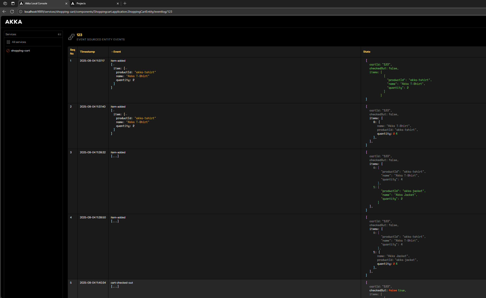

# Shopping Cart

This is a sample shopping cart application built with Java and Akka. It demonstrates the use of event sourcing to manage the state of a shopping cart. The cart's state is not stored directly, but is instead derived from a sequence of events. This approach provides a full audit trail of all changes to the cart and allows for advanced features like replaying events to reconstruct the cart's state at any point in time.

## Event Sourcing with Akka

This project uses Akka Persistence to implement event sourcing. When a command is sent to the `ShoppingCartEntity`, it is validated and then persisted as an event to a journal. The state of the shopping cart is then updated by applying the event. This ensures that the state is always consistent with the events that have been persisted.

Akka Persistence also provides support for snapshots, which are used to optimize the recovery process. Instead of replaying all events from the beginning of time, the entity can be restored from the latest snapshot and then only replay the events that have occurred since the snapshot was taken.

Here is a diagram that illustrates the event sourcing flow:


## Code Overview

### Domain

-   **`ShoppingCart.java`**: This is a `record` that represents the state of the shopping cart. It is immutable, and a new instance is created whenever the state changes. It contains the `cartId`, a list of `LineItem`s, and a `checkedOut` flag.
-   **`ShoppingCartEvent.java`**: This is a `sealed interface` that represents the events that can occur in the shopping cart. There are three types of events: `ItemAdded`, `ItemRemoved`, and `CartCheckedOut`.

### Application

-   **`ShoppingCartEntity.java`**: This is the `EventSourcedEntity` that manages the state of the shopping cart. It receives commands, validates them, and then persists events to the journal. The entity's state is updated by applying the events. It has methods for adding an item, removing an item, checking out, and getting the cart. The `@ComponentId("shopping-cart")` annotation identifies this entity as a component that can be managed by Akka.

    The `EventSourcedEntity` is the core of the event sourcing implementation. It ensures that the state of the shopping cart is always consistent with the events that have been persisted. It also handles the recovery process, replaying events from the journal to restore the state of the entity.

### API

-   **`ShoppingCartEndpoint.java`**: This class defines the HTTP endpoints for interacting with the shopping cart. It uses the `ComponentClient` to send commands to the `ShoppingCartEntity`. The `@HttpEndpoint("shoppingcarts")` annotation exposes the endpoints under the `/shoppingcarts` path.

## Technologies

- Java 21
- Akka
- Maven

## Features

- Add items to a shopping cart.
- Remove items from a shopping cart.
- Checkout a shopping cart.
- View the contents of a shopping cart.

## API Endpoints

The following API endpoints are available:

-   `POST /shoppingcarts/{cartId}/items/add`
    -   Adds an item to the shopping cart. This endpoint sends an `AddItem` command to the `ShoppingCartEntity`.
    -   **Request Body:**
        ```json
        {
          "productId": "prod-1",
          "name": "16GB RAM",
          "quantity": 1
        }
        ```
-   `POST /shoppingcarts/{cartId}/items/{productId}/remove`
    -   Removes an item from the shopping cart. This endpoint sends a `RemoveItem` command to the `ShoppingCartEntity`.
-   `POST /shoppingcarts/{cartId}/checkout`
    -   Checks out the shopping cart. This endpoint sends a `Checkout` command to the `ShoppingCartEntity`.
-   `GET /shoppingcarts/{cartId}`
    -   Retrieves the contents of the shopping cart. This endpoint sends a `GetCart` command to the `ShoppingCartEntity`.

## How to Run

### To run locally

1. **Build and run:**
    ```bash
    mvn compile exec:java
    ```
2. **To monitor on local console**
    ```bash
    akka local console
    ```
3. **You can now monitor your service locally and see its state**


### To run on the remore platform
1.  **Build the project:**
    ```bash
    mvn clean install
    ```
    This will create a docker image locally. Note the docker image name.

2.  **Deploy the service**
    ```bash
    akka service deploy shopping-cart-svc shopping-cart:1.0-SNAPSHOT-20250904014201 --push
    ```
    Deploy the sercuce by calling akka service deploy and passing in the docker image name and pusing it to the container registry with the --push parameter.

3. **Check the service status**
    ```bash
    akka service list
    ```
    This will show the status of your service. Wait until the status is `Running`.
    ```console
    NAME                AGE     INSTANCES   STATUS   IMAGE TAG                     
    shopping-cart-svc   2h33m   3           Ready    1.0-SNAPSHOT-20250904014201 
    ```
    You can also check it on the Akka Console
    
4. You can also now view the state change and the events that resulted in the state change in the akka console and also on the local console as below.

    

